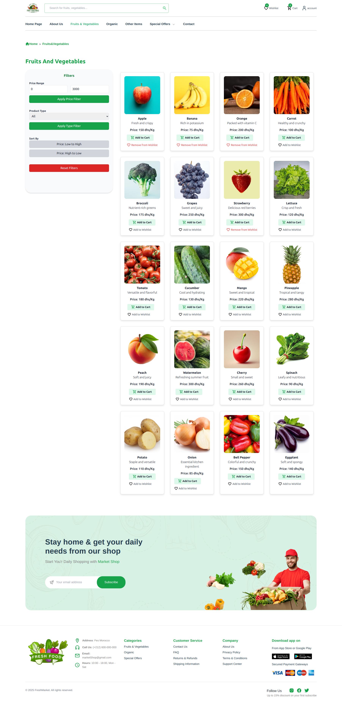
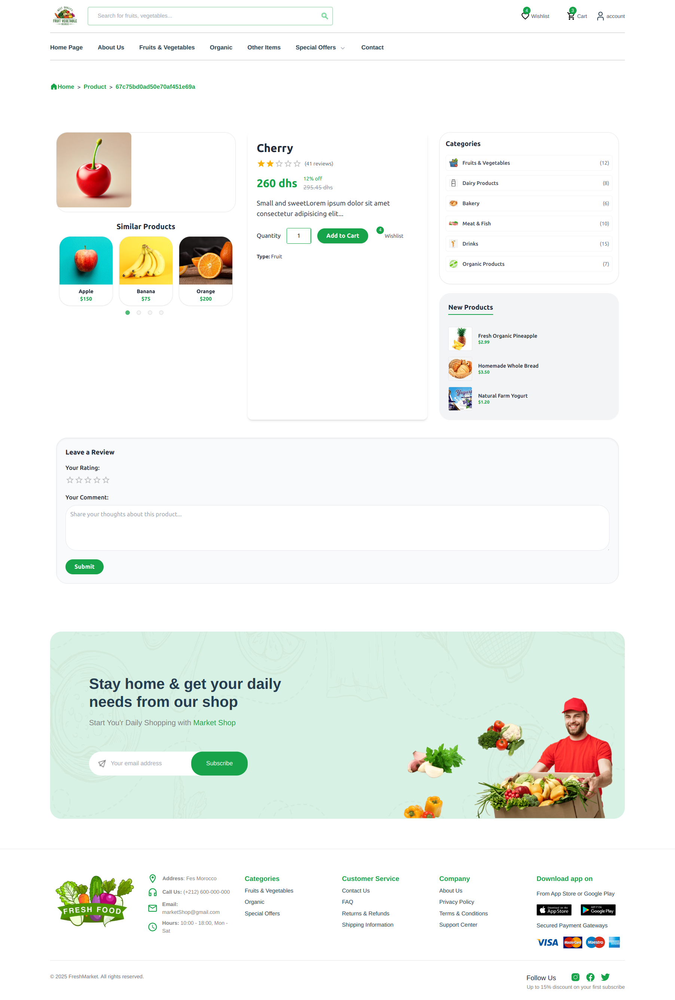
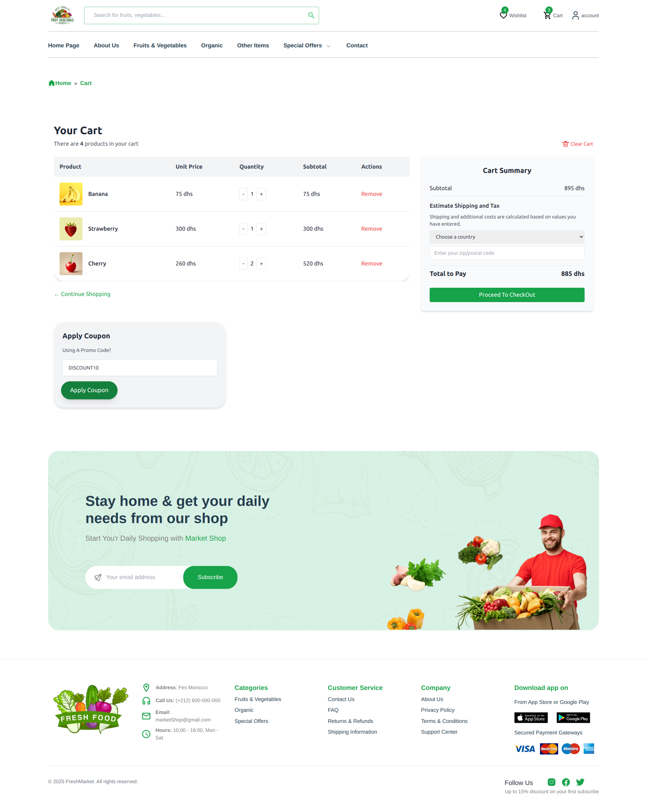
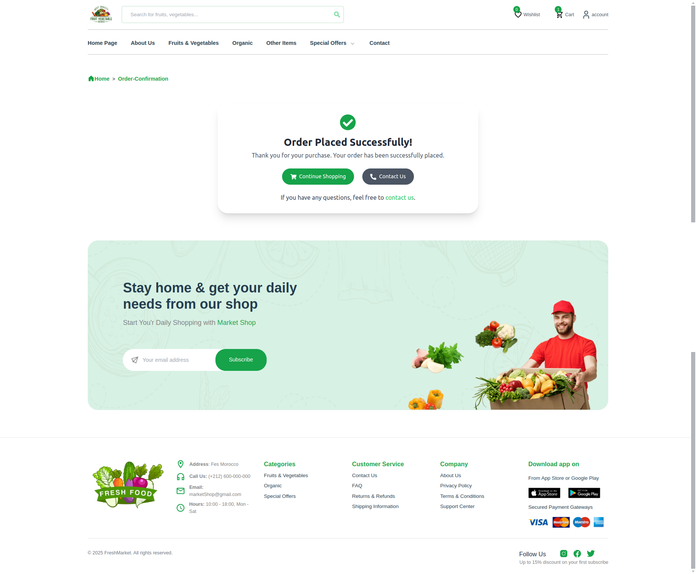
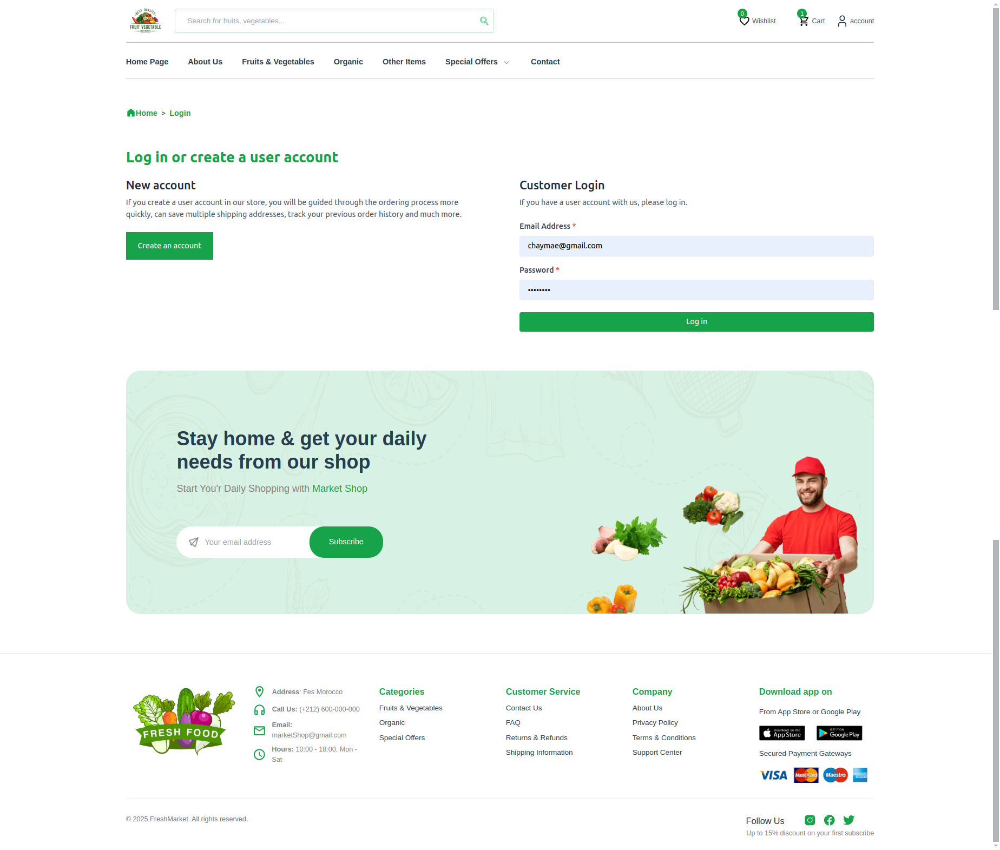
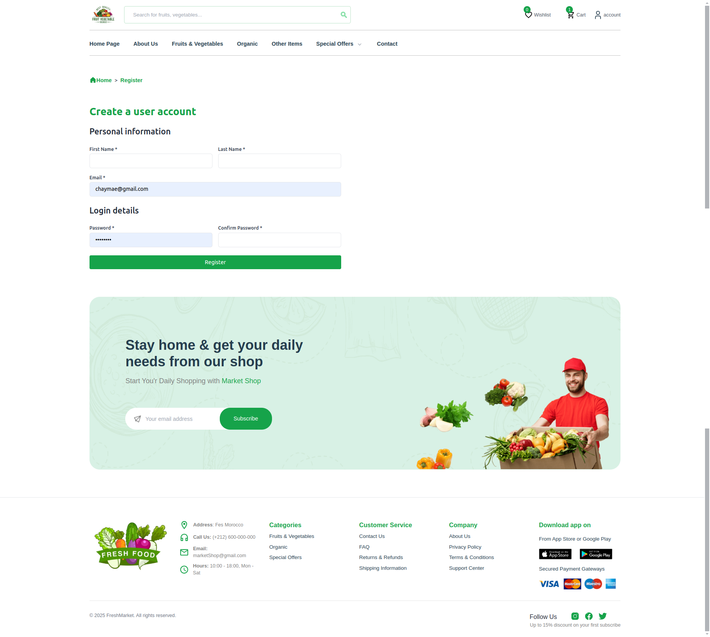
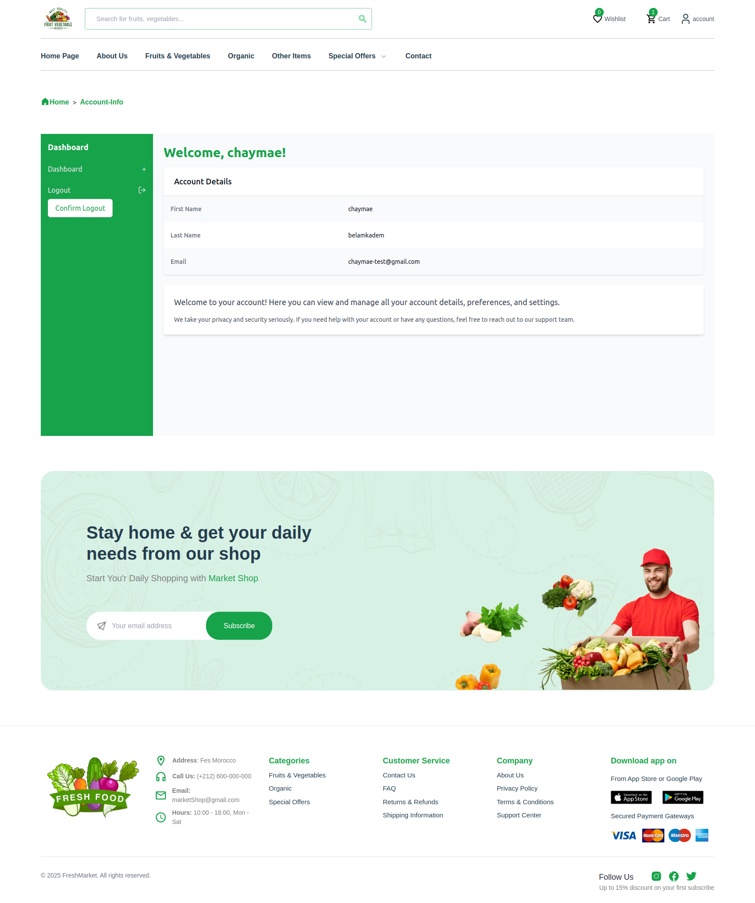
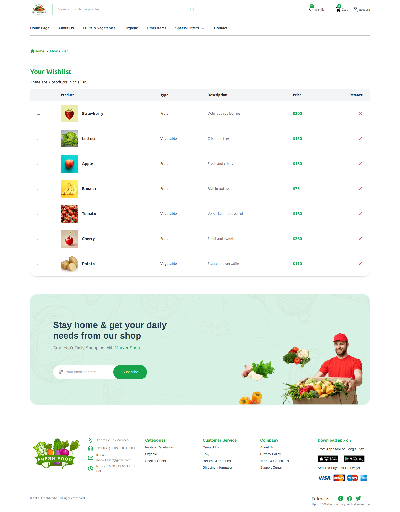
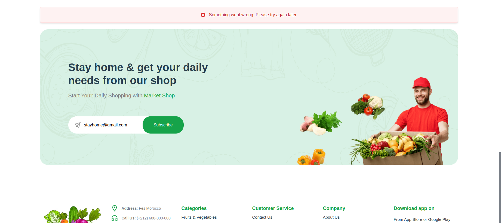
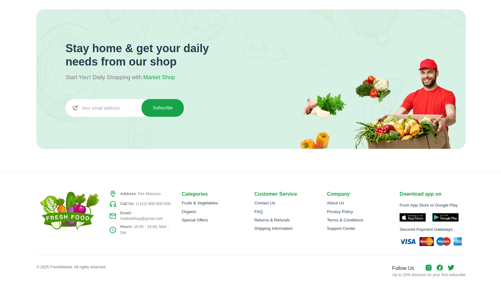

# 🥦 Fruit And Vegetable Market Shop 🥦

👩‍💻 **Author:** Chaymae Belamkadem

*****


*****
## 🚀 Steps:

- `git clone https://github.com/chama700/market_shop.git market_shop`

*****
🛠️ **Backend:**

- `cd market_shop/backend`
  
- `npm install`

- `node server.js`

*****
🎨 **Frontend:**

- `cd market_shop/backend/client`

- `npm install`

- `npm start`
- npm install react-svg
- npm install react-router-dom
- npm install react-slick
- npm install bcrypt
- npm install axios
- npm install jsonwebtoken
- npm install bcryptjs
- npm install @emotion/react @emotion/styled
*****
🌐 **Website:**
- http://localhost:3000
*****
📄 **Pages:**
- Home page
*****
  
*****
- Product Listing Page (PLP)
*****

*****
- Product Detail Page (PDP)
*****

*****
- Cart Page
*****

*****
- 🛒 Checkout Page
*****

*****
- 🎉 Success Page (order confirmation)
*****

*****
- 🔐 Login Page
*****

*****
- Register Page
*****

*****
- User Information Page
*****

*****
- ⭐ Wishlist page
*****

*****
- 📝 Newsletter : error popup + success popup + mongodb form save
*****

*****

*****

*****
- 📞 Contact Page : error popup + success popup + mongodb form save
*****

*****

*****

*****
- ❌ Not Found Page
*****

*****
- Header
*****

*****
- Footer
*****

*****
**Database:**

- Insert the data into the products collection:

```javascript
db.products.insertMany([
  {
    "_id": ObjectId("67c75710160dbaaaa7db6eaf"),
    "name": "Apple",
    "type": "Fruit",
    "description": "Fresh and crispy",
    "price": 150,
    "image": "/images/apple.jpg",
    "__v": 0
  },
  {
    "_id": ObjectId("67c75710160dbaaaa7db6eb0"),
    "name": "Banana",
    "type": "Fruit",
    "description": "Rich in potassium",
    "price": 75,
    "image": "/images/banana.jpg",
    "__v": 0
  },
  {
    "_id": ObjectId("67c75710160dbaaaa7db6eb1"),
    "name": "Orange",
    "type": "Fruit",
    "description": "Packed with vitamin C",
    "price": 200,
    "image": "/images/orange.jpg",
    "__v": 0
  },
  {
    "_id": ObjectId("67c75710160dbaaaa7db6eb2"),
    "name": "Carrot",
    "type": "Vegetable",
    "description": "Healthy and crunchy",
    "price": 100,
    "image": "/images/carrot.jpg",
    "__v": 0
  },
  {
    "_id": ObjectId("67c75710160dbaaaa7db6eb3"),
    "name": "Broccoli",
    "type": "Vegetable",
    "description": "Nutrient-rich greens",
    "price": 175,
    "image": "/images/brocoli.jpg",
    "__v": 0
  },
  {
    "_id": ObjectId("67c75710160dbaaaa7db6eb4"),
    "name": "Grapes",
    "type": "Fruit",
    "description": "Sweet and juicy",
    "price": 250,
    "image": "/images/grapes.jpg",
    "__v": 0
  },
  {
    "_id": ObjectId("67c75710160dbaaaa7db6eb5"),
    "name": "Strawberry",
    "type": "Fruit",
    "description": "Delicious red berries",
    "price": 300,
    "image": "/images/strawberry.jpg",
    "__v": 0
  },
  {
    "_id": ObjectId("67c75710160dbaaaa7db6eb6"),
    "name": "Lettuce",
    "type": "Vegetable",
    "description": "Crisp and fresh",
    "price": 120,
    "image": "/images/lettue.jpg",
    "__v": 0
  },
  {
    "_id": ObjectId("67c75710160dbaaaa7db6eb7"),
    "name": "Tomato",
    "type": "Vegetable",
    "description": "Versatile and flavorful",
    "price": 180,
    "image": "/images/tomato.jpg",
    "__v": 0
  },
  {
    "_id": ObjectId("67c75710160dbaaaa7db6eb8"),
    "name": "Cucumber",
    "type": "Vegetable",
    "description": "Cool and hydrating",
    "price": 130,
    "image": "/images/cocumber.jpg",
    "__v": 0
  },
  {
    "_id": ObjectId("67c75bd0ad50e70af451e696"),
    "name": "Mango",
    "type": "Fruit",
    "description": "Sweet and tropical",
    "price": 220,
    "image": "/images/mongo.jpeg"
  },
  {
    "_id": ObjectId("67c75bd0ad50e70af451e697"),
    "name": "Pineapple",
    "type": "Fruit",
    "description": "Tropical and tangy",
    "price": 280,
    "image": "/images/Pineapple.jpg"
  },
  {
    "_id": ObjectId("67c75bd0ad50e70af451e698"),
    "name": "Peach",
    "type": "Fruit",
    "description": "Soft and juicy",
    "price": 190,
    "image": "/images/Peach.webp"
  },
  {
    "_id": ObjectId("67c75bd0ad50e70af451e699"),
    "name": "Watermelon",
    "type": "Fruit",
    "description": "Refreshing summer fruit",
    "price": 300,
    "image": "/images/Watermelon.webp"
  },
  {
    "_id": ObjectId("67c75bd0ad50e70af451e69a"),
    "name": "Cherry",
    "type": "Fruit",
    "description": "Small and sweet",
    "price": 260,
    "image": "/images/cherry.webp"
  },
  {
    "_id": ObjectId("67c75bd0ad50e70af451e69b"),
    "name": "Spinach",
    "type": "Vegetable",
    "description": "Leafy and nutritious",
    "price": 90,
    "image": "/images/Spinach.webp"
  },
  {
    "_id": ObjectId("67c75bd0ad50e70af451e69c"),
    "name": "Potato",
    "type": "Vegetable",
    "description": "Staple and versatile",
    "price": 110,
    "image": "/images/Potato.jpg"
  },
  {
    "_id": ObjectId("67c75bd0ad50e70af451e69d"),
    "name": "Onion",
    "type": "Vegetable",
    "description": "Essential kitchen ingredient",
    "price": 85,
    "image": "/images/Onion.jpg"
  },
  {
    "_id": ObjectId("67c75bd0ad50e70af451e69e"),
    "name": "Bell Pepper",
    "type": "Vegetable",
    "description": "Colorful and crunchy",
    "price": 150,
    "image": "/images/Bell-Pepper.jpg"
  },
  {
    "_id": ObjectId("67c75bd0ad50e70af451e69f"),
    "name": "Eggplant",
    "type": "Vegetable",
    "description": "Soft and spongy",
    "price": 140,
    "image": "/images/Eggplant.jpg"
  }
]);

